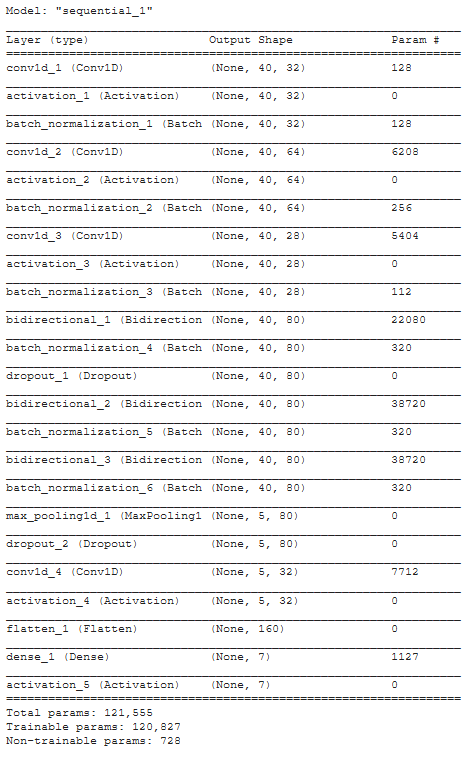

# Speech_Emotion_Recognition
The scope of this project is to create a classifier to predict the emotions of the speaker starting from an audio file.

Dataset:
RAVDESS Emotional song audio
RAVDESS Emotional speech audio

The classes we are trying to predict are the following: (0 = neutral, 1 = happy, 2 = sad, 3 = angry, 4 = fearful, 5 = disgust, 6 = surprised)

Trained using Classic ML:
- SVM
- Desicion Tree
- Random Forest

Also used NN:

Model:

EVAL:

Also, There is a real time notebook to predict Emotions directly..
